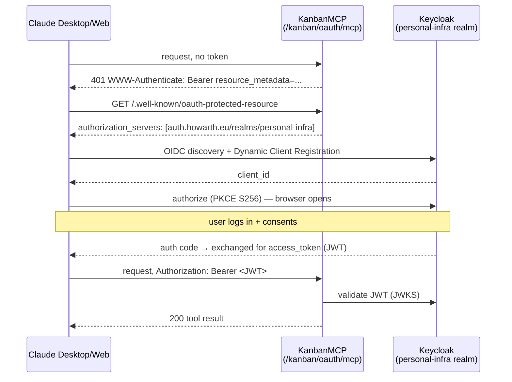
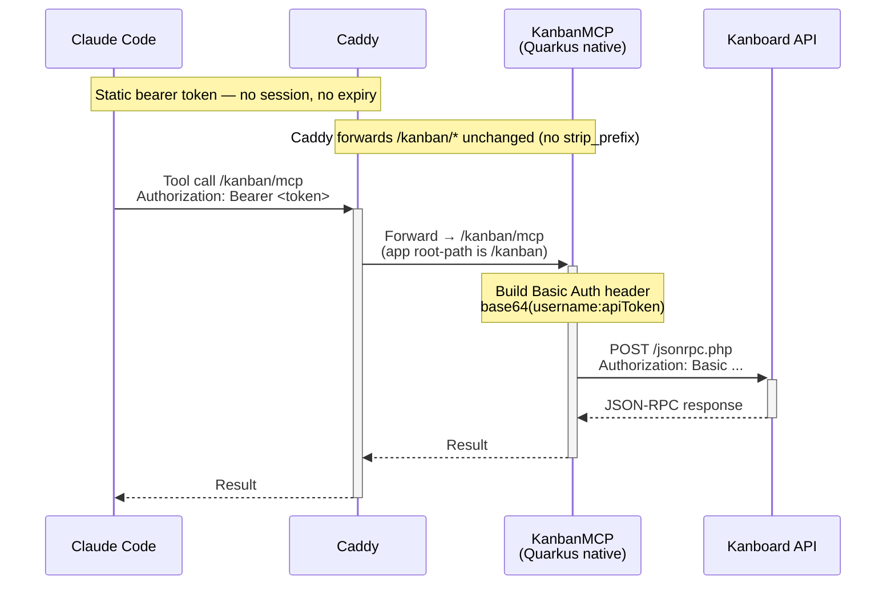

# KanbanMCP — Kanboard MCP Server

A Quarkus-native MCP (Model Context Protocol) server that bridges Claude to a [Kanboard](https://kanboard.org) instance. Lets Claude read boards, manage tasks, add comments, and move cards — from Claude Desktop or Claude Code.

## Stack

- **Java 25**, Quarkus 3.33.1 (LTS), `quarkus-mcp-server` 1.12.0
- **Deploy artifact:** GraalVM/Mandrel **native image** (~50 MB, boots in ~0.03 s, ~30 MB RAM)
- **MCP transport:** Streamable HTTP (`quarkus-mcp-server-http`)
- **MCP endpoint:** `/kanban/mcp` (HTTP `root-path` is `/kanban`)
- **Health endpoint:** `/kanban/q/health` (SmallRye Health)

## Tools (30)

| Class | Tool | What it does |
|-------|------|--------------|
| ProjectTools | `getAllProjects` | List all accessible projects |
| ProjectTools | `getProjectById` | Get project by ID |
| BoardTools | `getBoard` | Full board with columns and swimlanes |
| BoardTools | `getColumns` | Column IDs, names, positions |
| BoardTools | `moveTaskPosition` | Move task between columns |
| TaskTools | `searchTasks` | Search using Kanboard query syntax |
| TaskTools | `getTask` | Full task detail |
| TaskTools | `createTask` | Create task (title + projectId required) |
| TaskTools | `updateTask` | Update any task fields |
| TaskTools | `closeTask` | Mark task as done |
| TaskTools | `openTask` | Reopen a closed task |
| TaskTools | `moveTaskToProject` | Move a task to another project/column/swimlane |
| CommentTools | `getAllComments` | List comments on a task |
| CommentTools | `createComment` | Add a comment (authored by the automation user) |
| CommentTools | `updateComment` | Edit a comment authored by this server (overwrites content) |
| CommentTools | `removeComment` | Delete a comment authored by this server |
| SubtaskTools | `getAllSubtasks` | List subtasks (checklist items) on a task |
| SubtaskTools | `createSubtask` | Add a subtask to a task |
| SubtaskTools | `updateSubtask` | Update subtask title or status (0=todo, 1=in progress, 2=done) |
| SubtaskTools | `removeSubtask` | Delete a subtask |
| ExternalLinkTools | `getAllExternalTaskLinks` | List external links on a task |
| ExternalLinkTools | `createExternalTaskLink` | Attach a URL to a task (e.g. GitHub commit, PR) |
| ExternalLinkTools | `removeExternalTaskLink` | Remove an external link |
| TaskLinkTools | `getAllTaskLinks` | List internal task-to-task links |
| TaskLinkTools | `createTaskLink` | Link a task to another (relates to, blocks, etc.) |
| TaskLinkTools | `removeTaskLink` | Remove an internal task link |
| CategoryTools | `getAllCategories` | List categories defined in a project |
| TagTools | `getTagsByProject` | List all tags defined in a project |
| TagTools | `getTaskTags` | Get tags assigned to a task |
| TagTools | `setTaskTags` | Set tags on a task (replaces existing) |

## Configuration

| Env var | Default | Description |
|---------|---------|-------------|
| `KANBOARD_URL` | `https://kanban.howarth.eu/jsonrpc.php` | JSON-RPC endpoint |
| `KANBOARD_API_TOKEN` | *(required)* | API token from Kanboard profile |
| `KANBOARD_USERNAME` | `claude` | Basic auth username |

Get your API token: Kanboard → Profile → API → Personal token.

## Use with Claude Desktop

Add to `claude_desktop_config.json`:

**Remote (hosted):**
```json
{
  "mcpServers": {
    "kanban": {
      "command": "npx",
      "args": [
        "mcp-remote",
        "https://your-mcp-host/kanban/mcp"
      ]
    }
  }
}
```

**Local (running on your machine):**
```json
{
  "mcpServers": {
    "kanban": {
      "command": "npx",
      "args": [
        "mcp-remote",
        "http://localhost:8080/kanban/mcp"
      ]
    }
  }
}
```

Config file locations:
- **macOS:** `~/Library/Application Support/Claude/claude_desktop_config.json`
- **Windows:** `%APPDATA%\Claude\claude_desktop_config.json`

Restart Claude Desktop after editing. The MCP server will appear in the tools panel.

> This local `mcpServers` config is a separate mechanism from Claude's newer [Connectors](https://claude.com/docs/connectors/building) feature (Settings → Connectors), which is what Claude Desktop/web/mobile/Cowork actually need for a one-click "Add Connector" setup rather than editing a JSON file. See **OAuth (Claude Connectors)** below.

## OAuth (Claude Connectors) — recommended for Desktop/web/mobile

Add via Claude → Settings → Connectors → Add Connector, URL:

```
https://your-mcp-host/kanban/oauth/mcp
```

Claude drives the whole flow itself — discovery, registration, browser consent, token refresh — nothing to configure beyond entering the URL. This is a *separate, additive* endpoint: the bearer-token `mcpServers` setup above (used by Claude Code) is completely untouched and keeps working exactly as before.



**Status:** live in production and verified end-to-end from a real Claude Desktop client ([#2](https://github.com/marcushowarth/KanbanMCP/issues/2)) — `/kanban/oauth/mcp` is a second, OIDC-secured `quarkus-mcp-server` instance exposing the same tools, backed by Keycloak's `personal-infra` realm. Confirmed: the RFC 9728 handshake, protected-resource metadata, the Caddy passthrough for `/kanban/oauth/*` and `/kanban/.well-known/*`, and a full real Connector add — Keycloak login, consent, token issuance, tool calls all working from Desktop.

## Use with Claude Code

A `.mcp.json` is included in this repo. Claude Code will pick it up automatically when run from this directory, pointing at `http://localhost:8080/kanban/mcp`.

## Run locally

```bash
export KANBOARD_API_TOKEN=your_token
./mvnw quarkus:dev
```

Dev mode serves on port 8080. Test it:
```bash
curl http://localhost:8080/kanban/q/health
```

## Build and run native

```bash
# Build the native image (Linux binary via the Mandrel builder container — needs Docker)
./mvnw package -Dnative -Dquarkus.native.container-build=true \
  -Dquarkus.native.builder-image=quay.io/quarkus/ubi9-quarkus-mandrel-builder-image:jdk-25

# Wrap the runner in the runtime image and run it
docker build -f src/main/docker/Dockerfile.native -t kanban-mcp .
docker run -p 8080:8080 -e KANBOARD_API_TOKEN=your_token kanban-mcp
```

A JVM build (`./mvnw package` then `java -jar target/quarkus-app/quarkus-run.jar`) is the fallback if a native build is ever unavailable.

## Deploy (CI/CD)

This repo includes a GitHub Actions workflow (`.github/workflows/deploy.yml`) that runs on every push to `main`:

```
push to main
  → build native image + run native integration test (verify -Dnative)
  → build runtime Docker image (Dockerfile.native)
  → push to GHCR
  → SSH deploy to host (docker pull + docker run + image prune)
```

A separate `ci.yml` runs `verify` (tests only, no deploy) on every branch and pull request, so failures are caught before they reach `main`. Doc- and workflow-only changes don't trigger a deploy (`paths-ignore`).

**History:** originally deployed to AWS (EC2 + ECR). Migrated to Hetzner Cloud on 2026-07-24 — the first application of a "prove on big cloud, port to cheap dedicated once mature" hosting strategy. Full writeup in the wiki `Projects:KanbanMCP` Decision Log.

### Required GitHub Secrets

| Secret | Description |
|--------|-------------|
| `HETZNER_HOST` | Public IP of your host |
| `HETZNER_SSH_KEY` | SSH private key for the deploy user |
| `KANBOARD_API_TOKEN` | Passed to the container at runtime |

GHCR auth uses the built-in `GITHUB_TOKEN` — no registry credentials to manage.

### Host setup summary

- **GHCR** — `ghcr.io/marcushowarth/kanban-mcp`, authenticated via `GITHUB_TOKEN`
- **Host** — any Docker-capable box reachable over SSH (currently a Hetzner CX23)
- **Deploy user** — dedicated, own SSH key, docker group (not root)
- **Caddy** — reverse proxy on the host for HTTPS + automatic Let's Encrypt cert

## Auth model (bearer token / Claude Code)

See [OAuth (Claude Connectors)](#oauth-claude-connectors--recommended-for-desktopwebmobile) above for the Desktop/web/mobile path — this section covers the original bearer-token path, still used by Claude Code. Two auth layers: a static bearer token at Caddy (edge), and Basic Auth per request to Kanboard.



- **Caddy layer:** static bearer token, validated on every request — no sessions, no timeouts
- **Kanboard layer:** Basic Auth header built fresh on every `KanboardClient.execute()` call

## Design notes

- Quarkus CDI (`@ApplicationScoped`) beans; tools are auto-discovered `@Tool`-annotated methods (no manual registration)
- `KanboardClient` uses `java.net.http.HttpClient` — no extra HTTP libraries
- Tools return `JsonNode` pretty-printed as strings — no model POJOs needed
- Java records for all DTOs; `@RegisterForReflection` on the JSON-RPC DTOs so they survive native compilation
- `KANBOARD_API_TOKEN` must be injected at runtime — all other config has defaults in `application.yml`
- `ReadmeToolsTest` fails the build if the tool set drifts from the table above
